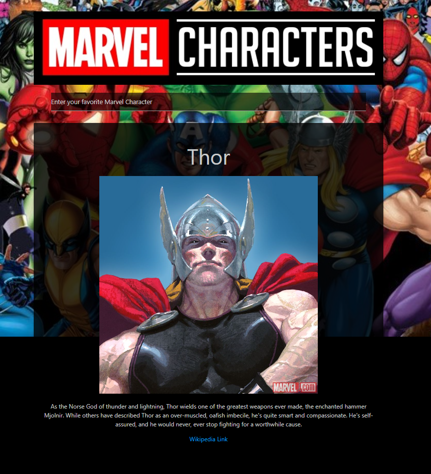

# Marvel Character Application

Search your favorite Marvel Character to get more information on them with this application!

## Description

This project's objective was to build a responsive website using HTML, CSS, and JavaScript to pull data from Marvel's and Wikipedia's API. This project contains a search input field for a user to search any marvel character, which returns a card displaying the character's name, thumbnail, and a short description, all which are taken from Marvel's API. Underneath the description is a wikipedia link, matching with the user's input using Wikipedia's API, if the user wants more information on that character.

## Installation

Using git bash (Windows) or terminal (MacOS):

1. Download ZIP found under `<> Code` and run the repo to open into VS Code  
OR clone the repo using `git clone git@github.com:pljon/marvel-character-project.git`
2. Path to repo's location on local machine using `cd`
3. Open repo on VS code using `code .` to begin working on it locally

## Remote Link

This link reflects the current source code found in this repo:

https://pljon.github.io/marvel-character-project/

## Screenshot

## Credits

Project team members:
1. Marc Nicolas
2. Isaac Daniels
3. Mekael Abdullah
4. Jonathan Plaras

Marvel API
Wikipedia API